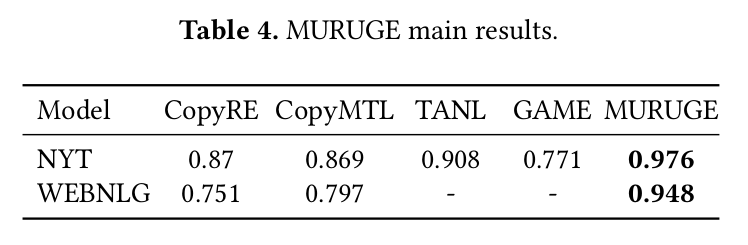

# SOTA-Multi-Relation-Classification

The repository shows my state-of-the-art results on the multiple relation classification task. This task is a NLP core task in extracting triple from unstructured text, knowledge graphs construction and question-answering systems.

Full code to be published here once getting the paper published.

